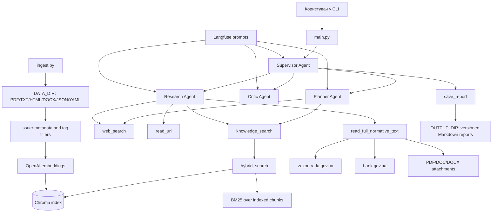

# Final Project

## Архітектурна діаграма



Основний потік:

1. `ingest.py` читає документи з `DATA_DIR`, додає metadata, фільтрує за тегами,
   створює embeddings і записує chunks у Chroma.
2. `main.py` запускає CLI для діалогу з користувачем.
3. Supervisor викликає Planner, Research і Critic.
4. Для українських регуляторних питань агенти спочатку використовують
   `knowledge_search` поверх локального RAG-індексу.
5. Web використовується для міжнародного контексту або для точкового добору
   повного офіційного тексту українського нормативного документа, якого бракує
   в RAG.
6. Перед записом звіту спрацьовує HITL approval для `save_report`.
7. Звіт зберігається у `OUTPUT_DIR` з автоматичною версійністю імені файлу.

## Повна інструкція запуску

### 1. Перейти в каталог проєкту

```powershell
cd final-project
```

### 2. Створити та заповнити `.env`

Якщо `.env` ще немає, скопіювати приклад:

```powershell
Copy-Item .env.example .env
```

Мінімально потрібні параметри:

```env
OPENAI_API_KEY=...
DATA_DIR=data
INDEX_DIR=index
CHROMA_COLLECTION=final-project_kb
OUTPUT_DIR=output
INGEST_REBUILD_INDEX=true
INGEST_TAG_FILTERS=issuer_match:nbu,issuer_match:ema
```

Langfuse можна вимкнути для локального запуску:

```env
LANGFUSE_ENABLED=false
```

Якщо Langfuse використовується, потрібно заповнити ключі та prompt names:

```env
LANGFUSE_ENABLED=true
LANGFUSE_SECRET_KEY=...
LANGFUSE_PUBLIC_KEY=...
LANGFUSE_BASE_URL=https://cloud.langfuse.com
LANGFUSE_PROMPT_LABEL=production
SUPERVISOR_PROMPT_NAME=final-project/supervisor-system
PLANNER_PROMPT_NAME=final-project/planner-system
RESEARCH_PROMPT_NAME=final-project/research-system
CRITIC_PROMPT_NAME=final-project/critic-system
```

### 3. Встановити залежності

З активованого virtualenv:

```powershell
pip install -r requirements.txt
```

### 4. Додати документи

Покласти файли у каталог, заданий через `DATA_DIR`, зазвичай:

```text
final-project/data
```

Підтримуються PDF, TXT, HTML, DOC/DOCX, JSON, YAML/YML.

### 5. Побудувати або доповнити RAG-індекс

```powershell
python ingest.py
```

Якщо `INGEST_REBUILD_INDEX=true`, старий `INDEX_DIR` буде видалений і база
побудується заново. Якщо `INGEST_REBUILD_INDEX=false`, нові chunks будуть
додані до існуючої Chroma collection.

### 6. Синхронізувати prompts у Langfuse

Цей крок потрібен тільки якщо `LANGFUSE_ENABLED=true` і prompts змінювалися
локально у `langfuse_prompts/system_prompts.json`:

```powershell
python sync_langfuse_prompts.py
```

Після синхронізації потрібно перезапустити застосунок, бо prompts кешуються у
процесі Python.

### 7. Запустити агента

```powershell
python main.py
```

Опційно можна задати окремий thread/session/tag:

```powershell
python main.py --thread-id final-project-supervisor-cli --session-id consent-research --tag manual-run
```

Після запуску CLI покаже:

```text
Multi-agent Research Supervisor (type 'exit' to quit)
You:
```

Для виходу:

```text
exit
```

### 8. Підтвердити збереження звіту

Коли Supervisor підготує звіт, `save_report` потребує підтвердження:

```text
approve / edit / reject:
```

Варіанти:

- `approve` - зберегти звіт у `OUTPUT_DIR`;
- `edit` - дати feedback перед продовженням;
- `reject` - відхилити запис звіту.

## Приклади використання агента

### Максимальний строк дії consent

Запит:

```text
Який максимальний термін дії консенту у відкритому банкінгу в Україні?
```

Очікувана поведінка:

- агент спочатку шукає в RAG через `knowledge_search`;
- якщо RAG посилається на постанову НБУ або закон, але повного пункту немає,
  агент шукає офіційний текст спочатку на `zakon.rada.gov.ua`;
- якщо потрібно, читає повний нормативний текст через
  `read_full_normative_text` з динамічними `search_terms`;
- у звіті порівнює RAG і WEB-знахідки.

### Порівняння RAG і web для нормативного документа

Запит:

```text
Перевір, що RAG знає про постанову НБУ №80, і порівняй з офіційним текстом на zakon.rada.gov.ua.
```

Очікувана поведінка:

- RAG використовується як перше джерело;
- web використовується тільки для добору повного офіційного тексту;
- висновок має окремо показати, що було в RAG, що уточнено через WEB, і чи є
  розбіжності.

### Дослідження документів НБУ та EMA

Перед запуском ingest:

```env
INGEST_TAG_FILTERS=issuer_match:nbu,issuer_match:ema
INGEST_REBUILD_INDEX=true
```

Потім:

```powershell
python ingest.py
python main.py
```

Запит:

```text
Порівняй вимоги НБУ до відкритого банкінгу з технічними специфікаціями EMA щодо consent API.
```

Очікувана поведінка:

- `knowledge_search` шукає у локальних документах НБУ та EMA;
- web використовується тільки для зовнішнього або відсутнього нормативного
  контексту;
- звіт розділяє правові вимоги, технічні специфікації і прогалини.

### Збереження повторних звітів

Якщо кілька разів поставити однаковий або дуже схожий запит:

```text
Який максимальний термін дії консенту?
```

звіти будуть збережені з одним базовим slug і новими версіями:

```text
maksymalnyi-termin-dii-konsentu.md
maksymalnyi-termin-dii-konsentu.v2.md
maksymalnyi-termin-dii-konsentu.v3.md
```

## Ingest: завантаження документів у локальну базу знань

`ingest.py` будує або доповнює локальний Chroma-індекс для `knowledge_search`.
Після запуску агент шукає не напряму у файлах, а в індексі з каталогу
`INDEX_DIR`.

### Підтримувані формати

Файли потрібно покласти в каталог, заданий через `DATA_DIR`:

```env
DATA_DIR=data
```

Підтримуються:

- `.pdf`
- `.txt`
- `.json`
- `.yaml`
- `.yml`
- `.html`
- `.htm`
- `.doc`
- `.docx`

JSON і YAML перетворюються на читабельний текст перед індексацією. Якщо JSON
або YAML невалідний, файл буде завантажений як plain text.

### Запуск

З каталогу `final-project`:

```powershell
python ingest.py
```

Під час запуску `ingest.py`:

1. читає документи з `DATA_DIR`;
2. додає metadata і теги;
3. фільтрує документи, якщо задано `INGEST_TAG_FILTERS`;
4. розбиває документи на chunks;
5. створює embeddings через OpenAI;
6. записує chunks у Chroma.

### Куди записується індекс

```env
INDEX_DIR=index
CHROMA_COLLECTION=final-project_kb
```

Фізично база зберігається в:

```text
final-project/index
```

`CHROMA_COLLECTION` задає ім’я collection всередині Chroma. `ingest.py` пише
документи в цю collection, а `knowledge_search` читає з неї.

### Видаляти базу чи доповнювати

Поведінка задається параметром:

```env
INGEST_REBUILD_INDEX=true
```

Значення:

- `true` - видалити існуючий `INDEX_DIR` і побудувати базу заново;
- `false` - не видаляти базу, а додати нові chunks в існуючий Chroma index.

За замовчуванням використовується rebuild-режим, щоб база відповідала поточному
набору файлів і фільтрів.

### Фільтрація документів

Фільтр задається через:

```env
INGEST_TAG_FILTERS=issuer_match:nbu
```

Якщо значення непорожнє, в embeddings і Chroma потраплять тільки документи, які
мають хоча б один із указаних тегів.

Приклади:

```env
INGEST_TAG_FILTERS=issuer_match:nbu
```

Індексувати тільки документи, де знайдені NBU-ключові слова.

```env
INGEST_TAG_FILTERS=issuer_match:nbu,issuer_match:nssmc
```

Індексувати документи, де знайдені NBU або "Національна комісія з цінних паперів та фондового ринку" ключові слова.

```env
INGEST_TAG_FILTERS=
```

Вимкнути фільтр і індексувати всі підтримувані файли.

### Теги органів

Під час ingest кожен документ отримує metadata:

- `issuer` - основний визначений орган;
- `issuer_key` - машинний ключ органу;
- `file_type` - формат файлу;
- `tags` - список тегів через кому.

Приклад:

```text
issuer:nbu,format:json,issuer_match:nbu
```

`issuer:*` - основна класифікація документа.

`issuer_match:*` - документ містить ключові слова відповідного органу. Саме ці
теги зручно використовувати для ingest-фільтрів, бо документ може бути законом
Верховної Ради, але містити важливі згадки НБУ.

Поточні ключі:

- `issuer_match:verkhovna_rada`
- `issuer_match:ema`
- `issuer_match:nbu`
- `issuer_match:cabinet_ministers`
- `issuer_match:president`
- `issuer_match:minjust`
- `issuer_match:nssmc`
- `issuer_match:tax_service`
- `issuer_match:constitutional_court`
- `issuer_match:supreme_court`

### Фільтри metadata за органом-видавцем

Фільтрація RAG-записів за органом-видавцем базується на metadata, які
створюються під час ingest. Основна логіка знаходиться в:

```text
final-project/kb_common.py
```

Там є список правил:

```python
ISSUER_RULES = (
    (
        "nbu",
        "Національний банк України",
        (
            "національний банк україни",
            "правління національного банку україни",
            "постанова правління національного банку",
            "нбу",
        ),
    ),
    ...
)
```

Кожне правило має три частини:

- ключ органу, наприклад `nbu`;
- людиночитну назву, наприклад `Національний банк України`;
- набір ключових фраз, за якими ingest визначає збіг.

Під час обробки документа ingest перевіряє назву файлу та першу частину тексту
документа на наявність цих ключових фраз. Після цього в metadata додаються:

```text
issuer
issuer_key
tags
```

Приклад metadata для документа, де знайдено НБУ:

```text
issuer=Національний банк України
issuer_key=nbu
tags=issuer:nbu,format:txt,issuer_match:nbu
```

#### `issuer:*` і `issuer_match:*`

Є два типи issuer-тегів:

```text
issuer:nbu
issuer_match:nbu
```

`issuer:*` - це основна класифікація документа. Вона визначає, який орган
найімовірніше є головним для документа.

`issuer_match:*` - це факт, що в документі знайдено ключові слова певного
органу. Один документ може мати кілька `issuer_match:*`.

Наприклад, закон Верховної Ради може містити згадки НБУ. Тоді metadata можуть
виглядати так:

```text
issuer:verkhovna_rada,format:htm,issuer_match:verkhovna_rada,issuer_match:nbu
```

У цьому випадку:

- `issuer:verkhovna_rada` означає, що основним issuer визначено Верховну Раду;
- `issuer_match:nbu` означає, що документ містить NBU-ключові слова.

Для ingest-фільтрів зазвичай краще використовувати `issuer_match:*`, бо він не
втрачає документи, де потрібний орган згадується, але не є основним issuer.

#### Як фільтрувати документи для RAG

Фільтр задається в `.env`:

```env
INGEST_TAG_FILTERS=issuer_match:nbu
```

Це означає: до embeddings і Chroma потраплять тільки документи, які мають тег
`issuer_match:nbu`.

Кілька органів можна вказати через кому:

```env
INGEST_TAG_FILTERS=issuer_match:nbu,issuer_match:nssmc
```

Це означає: індексувати документи, де знайдено ключові слова НБУ або НКЦПФР.

Для документів EMA / Open API Group:

```env
INGEST_TAG_FILTERS=issuer_match:ema
```

Щоб індексувати документи НБУ та EMA разом:

```env
INGEST_TAG_FILTERS=issuer_match:nbu,issuer_match:ema
```

Щоб індексувати тільки документи, основним issuer яких визначено НБУ:

```env
INGEST_TAG_FILTERS=issuer:nbu
```

Такий фільтр суворіший і може пропустити документи, де НБУ згадується, але
основним issuer визначено інший орган.

Щоб вимкнути фільтрацію:

```env
INGEST_TAG_FILTERS=
```

#### Як додати новий issuer-фільтр

Щоб додати новий орган:

1. Відкрити `final-project/kb_common.py`.
2. Додати новий запис у `ISSUER_RULES`.
3. Використати унікальний машинний ключ.
4. Додати кілька характерних ключових фраз.
5. Запустити ingest заново.

Приклад:

```python
(
    "minfin",
    "Міністерство фінансів України",
    (
        "міністерство фінансів україни",
        "мінфін",
        "наказ міністерства фінансів",
    ),
),
```

Після цього можна фільтрувати:

```env
INGEST_TAG_FILTERS=issuer_match:minfin
```

або:

```env
INGEST_TAG_FILTERS=issuer:minfin
```

#### Коли перебудовувати індекс

Якщо змінено `ISSUER_RULES` або `INGEST_TAG_FILTERS`, бажано запускати ingest з:

```env
INGEST_REBUILD_INDEX=true
```

Інакше стара база може містити записи, створені за попередніми правилами
класифікації або попередніми фільтрами.

Якщо потрібно лише додати нові файли з тими самими правилами metadata, можна
використати:

```env
INGEST_REBUILD_INDEX=false
```

### Важливі умови

- Для запуску потрібен `OPENAI_API_KEY`, бо embeddings створюються через OpenAI.
- Якщо OpenAI quota вичерпана, ingest впаде з `insufficient_quota`.
- Старі `.doc` файли найкраще читаються, якщо в системі є `antiword`, `catdoc`
  або LibreOffice `soffice`. Без них використовується fallback-витяг тексту.
- Якщо змінюєш `INGEST_TAG_FILTERS`, бажано запускати з
  `INGEST_REBUILD_INDEX=true`, щоб стара база не змішувалась із новим набором
  документів.
- Після успішного ingest `knowledge_search` працює з індексом, а не з файлами
  напряму.

### Обробка великої кількості файлів

`ingest.py` може обробляти тисячі файлів, але важливо розуміти, що найдорожчий
етап - не читання файлів, а створення embeddings для chunks.

Пайплайн працює так:

1. сканує всі підтримувані файли в `DATA_DIR`;
2. читає й нормалізує текст;
3. застосовує `INGEST_TAG_FILTERS`;
4. розбиває відібрані документи на chunks;
5. batch-ами додає chunks у Chroma через OpenAI embeddings.

Під час читання файлів у логах видно прогрес:

```text
Scanned 100/3022 non-PDF files; matched=...
Scanned 200/3022 non-PDF files; matched=...
```

Під час embeddings видно прогрес по chunks:

```text
Embedded 256/7376 chunks
Embedded 512/7376 chunks
```

Якщо файлів багато, бажано:

- використовувати `INGEST_TAG_FILTERS`, щоб не embedding-увати зайві документи;
- запускати з `INGEST_REBUILD_INDEX=true`, якщо змінювався фільтр або набір
  файлів;
- запускати з `INGEST_REBUILD_INDEX=false`, якщо потрібно лише доповнити
  існуючу базу новими документами;
- стежити за кількістю chunks у логах, бо саме вона впливає на час і вартість
  OpenAI embeddings;
- не переривати процес під час embedding-етапу, якщо очікується консистентна
  база.

Для дуже великих наборів файлів практичний підхід - індексувати частинами:

1. тимчасово покласти в `DATA_DIR` тільки потрібну групу файлів або вказати
   окремий каталог через `.env`;
2. виставити `INGEST_REBUILD_INDEX=true` для першої групи;
3. для наступних груп виставити `INGEST_REBUILD_INDEX=false`;
4. запускати `python ingest.py` для кожної групи.

Приклад:

```env
DATA_DIR=data_nbu_batch_1
INGEST_REBUILD_INDEX=true
INGEST_TAG_FILTERS=issuer_match:nbu
```

Потім:

```env
DATA_DIR=data_nbu_batch_2
INGEST_REBUILD_INDEX=false
INGEST_TAG_FILTERS=issuer_match:nbu
```

Так можна поступово доповнювати одну й ту саму Chroma collection, не
перебудовуючи всю базу щоразу.

## Оптимізація пошуку по нормативних сайтах

Для українських нормативних документів агенти мають працювати за RAG-first
логікою: спочатку `knowledge_search` шукає у локальній базі, а web
використовується тільки тоді, коли RAG посилається на конкретний закон,
постанову, положення або інший первинний документ, але повного потрібного
тексту в RAG немає.

Оптимізований інструмент для таких випадків:

```text
read_full_normative_text(url, search_terms)
```

Його потрібно використовувати для офіційних нормативних URL, а не звичайний
`read_url`, якщо висновок залежить від точного тексту документа.

### Пріоритет джерел

Пошук повного нормативного тексту виконується з таким пріоритетом:

1. `zakon.rada.gov.ua` - основне джерело для законів, постанов, положень та
   офіційних текстів, якщо документ там доступний.
2. сайт органу-видавця, наприклад `bank.gov.ua`, якщо на `zakon.rada.gov.ua`
   немає потрібного тексту, вкладення або актуальної версії.

Для `zakon.rada.gov.ua` URL нормалізується до сторінки тексту, наприклад:

```text
https://zakon.rada.gov.ua/laws/show/v0080500-25#Text
```

Це зменшує ризик, що агент прочитає навігаційну сторінку, короткий опис або
нерелевантний фрагмент замість самого нормативного тексту.

### Витягування тексту і вкладень

Для `zakon.rada.gov.ua` і `bank.gov.ua` інструмент не обмежується HTML-текстом
сторінки. Він також:

- знаходить посилання на вкладення та повні тексти;
- пріоритезує PDF/DOC/DOCX за URL, текстом посилання і службовими ознаками;
- відкидає менш релевантні матеріали на кшталт новин, пояснювальних записок,
  результатів обговорення або вторинних файлів, якщо є кращий кандидат;
- завантажує PDF/DOC/DOCX і витягує текст уже з самого документа;
- повертає разом текст основної сторінки і релевантних вкладень.

Це важливо для сайтів, де HTML-сторінка містить лише картку документа, а
юридично значущий текст лежить у PDF або Word-файлі.

### Точкове витягування фрагментів

`read_full_normative_text` приймає `search_terms`. Це не фіксований глобальний
список ключових слів. Агент має формувати його динамічно для кожного запиту з:

- питання користувача;
- знайдених у RAG термінів;
- назви, номера і дати документа;
- релевантних правових понять;
- доменних термінів, наприклад API-поля або назви процедур.

Приклад для питання про строк дії згоди:

```text
згода, строк дії, термін дії, максимальний, consent, validTo
```

Інструмент сканує повний витягнутий текст, знаходить збіги за цими словами і
повертає тільки релевантні фрагменти з контекстом. Це зменшує кількість тексту,
який потрапляє в LLM, але зберігає потрібні нормативні місця для перевірки.

### Налаштування лімітів

Поведінка керується параметрами `.env`:

```env
MAX_URL_CONTENT_LENGTH=5000
MAX_NORMATIVE_DOC_CHARS=500000
NORMATIVE_EXCERPT_WINDOW=2500
NORMATIVE_EXCERPT_MAX_FRAGMENTS=8
```

`MAX_URL_CONTENT_LENGTH` використовується для звичайного `read_url`.

`MAX_NORMATIVE_DOC_CHARS` обмежує максимальний обсяг тексту, який
`read_full_normative_text` може повернути агенту. Якщо збільшити цей ліміт,
агент отримує більше контексту, але зростають витрати і ризик шуму в промпті.

`NORMATIVE_EXCERPT_WINDOW` задає кількість символів до і після знайденого
ключового слова у точковому фрагменті.

`NORMATIVE_EXCERPT_MAX_FRAGMENTS` задає максимальну кількість фрагментів з
одного нормативного документа.

Практичне правило: краще уточнювати `search_terms`, ніж просто збільшувати
`MAX_NORMATIVE_DOC_CHARS`. Збільшення ліміту варто використовувати лише тоді,
коли документ справді великий і потрібний пункт не потрапляє у знайдені
фрагменти.

### Як це має відображатися у звіті

Якщо web використовувався для українського нормативного документа, фінальний
звіт має розділяти:

- що було знайдено в RAG;
- якого повного первинного документа бракувало в RAG;
- який офіційний URL був прочитаний через `read_full_normative_text`;
- які `search_terms` були використані;
- які фрагменти підтвердили або не підтвердили висновок;
- чим WEB-результат уточнює, доповнює або спростовує RAG.

## Збереження звітів і версійність output-файлів

Фінальний звіт зберігається інструментом:

```text
save_report(topic, content)
```

`topic` - це не назва файлу, а короткий стабільний опис теми запиту. Агент має
передавати однаковий або дуже схожий `topic` для однакових чи дуже схожих
запитів. Код перетворює `topic` на безпечний slug для імені файлу.

Звіти записуються у каталог:

```env
OUTPUT_DIR=output
```

Фізично це:

```text
final-project/output
```

Правило версійності:

- якщо для теми ще немає файлу, створюється `<topic-slug>.md`;
- якщо такий файл уже існує, створюється `<topic-slug>.v2.md`;
- наступні повтори створюють `<topic-slug>.v3.md`, `<topic-slug>.v4.md` і так далі.

Приклад:

```text
maksymalnyi-termin-dii-konsentu.md
maksymalnyi-termin-dii-konsentu.v2.md
maksymalnyi-termin-dii-konsentu.v3.md
```

Це дозволяє не перезаписувати попередні звіти, але групувати результати для
однакових або близьких запитів під одним базовим іменем.

Важливо: у `topic` не потрібно передавати `.md`, шлях до файлу, дату або номер
версії. Версію додає код автоматично.

## Langfuse prompts: додавання та оновлення промптів

System prompts для агентів описані локально у файлі:

```text
final-project/langfuse_prompts/system_prompts.json
```

У цьому manifest-файлі для кожного prompt-а задано:

- `name` - ім'я prompt-а в Langfuse;
- `type` - тип prompt-а, зараз `text`;
- `labels` - labels, наприклад `production`;
- `prompt` - текст system prompt-а.

Поточні prompt names:

```text
final-project/planner-system
final-project/research-system
final-project/critic-system
final-project/supervisor-system
```

### Налаштування Langfuse

У `.env` мають бути задані ключі та names prompt-ів:

```env
LANGFUSE_ENABLED=true
LANGFUSE_SECRET_KEY="..."
LANGFUSE_PUBLIC_KEY="..."
LANGFUSE_BASE_URL="https://cloud.langfuse.com"
LANGFUSE_DEFAULT_TAGS="mas,final-project"
LANGFUSE_PROMPT_LABEL=production

SUPERVISOR_PROMPT_NAME="final-project/supervisor-system"
PLANNER_PROMPT_NAME="final-project/planner-system"
RESEARCH_PROMPT_NAME="final-project/research-system"
CRITIC_PROMPT_NAME="final-project/critic-system"
```

Runtime-код не читає `system_prompts.json` напряму. Під час запуску агенти
завантажують prompts із Langfuse через:

```text
final-project/prompt_management.py
```

Тому після зміни JSON-файлу потрібно синхронізувати prompts у Langfuse.

### Синхронізація prompts у Langfuse

З каталогу `final-project`:

```powershell
python sync_langfuse_prompts.py
```

Скрипт читає:

```text
langfuse_prompts/system_prompts.json
```

і для кожного запису викликає:

```python
langfuse.create_prompt(...)
```

Це створює **нову версію** prompt-а з тим самим `name`, а не видаляє історію.
Якщо вказано label `production`, нова версія стає доступною за:

```python
get_prompt(name, label="production")
```

### Коли потрібен restart застосунку

`prompt_management.py` кешує завантажені prompts через `lru_cache`. Тому якщо
застосунок уже був запущений до синхронізації, він може продовжити працювати зі
старими prompt-ами в пам'яті.

Після:

```powershell
python sync_langfuse_prompts.py
```

потрібно перезапустити застосунок:

```powershell
python main.py
```

### Типовий workflow зміни prompts

1. Відредагувати `final-project/langfuse_prompts/system_prompts.json`.
2. Перевірити JSON:

   ```powershell
   python -m json.tool langfuse_prompts/system_prompts.json
   ```

3. Синхронізувати prompts у Langfuse:

   ```powershell
   python sync_langfuse_prompts.py
   ```

4. Перезапустити застосунок.

### Важливо

- Якщо prompt змінився в JSON, але не був синхронізований, агенти його не
  побачать.
- Якщо prompt був синхронізований, але застосунок не перезапущений, може
  використовуватись стара кешована версія.
- Якщо в `.env` вказано інший `LANGFUSE_PROMPT_LABEL`, застосунок читатиме
  prompt саме з цього label.
- Старі версії prompt-ів залишаються в Langfuse history.
